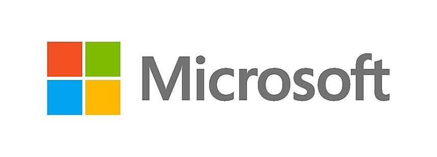

# General Information

### Who is organizing the workshop?

This year's workshop is organized by:
1. Weiwei Pan (Harvard IACS)
2. Karren Dai Yang (MIT IDSS)

### What will you do at the workshop?
The WiDS  Datathon workshop consists of a data science/machine learning tutorial followed by a team-based practical session focused on a single data science task. In this workshop:
1.  you will be introduced to data science/machine learning concepts and methods (especially relevant to the WiDS Datathon Challenge)
2.  you will be able to form teams during the workshop and get hands-on experience implementing machine learning models and working with the WiDS Datathon dataset 
3.  you will receive mentoring from data scientists and machine learning researchers from universities and tech companies in the Boston area.

### Who should sign up for the workshop?
We invite all participants with a strong interest in data science! 

Programming experience as well as some previous training in probability, statistics and mathematics is helpful. But we welcome participants from all backgrounds!

### Where is the workshop located?

The workshop will be held at:

&nbsp;&nbsp;&nbsp;&nbsp;&nbsp;&nbsp;*1 Memorial Drive* 
&nbsp;&nbsp;&nbsp;&nbsp;&nbsp;&nbsp;*Floor M* 
&nbsp;&nbsp;&nbsp;&nbsp;&nbsp;&nbsp;*Cambridge, MA 02142*

### How do I get there?

**Parking information:** The One Memorial Drive parking garage is in the NERD Center building and is open to the public. This garage is privately owned, and Microsoft is unable to validate parking. The daily maximum rate is $37.00. 
​
**Public Transportation:** The NERD Center is a .3 mile walk from the Kendall/MIT red line stop and a .4 mile walk from several bus lines.

### What should you bring to the workshop?
You will need to bring a laptop. 

You must bring a ***government or school issued ID*** and check-in at the Microsoft front desk at the main entrance. You will then be directed to floor M. 

---

# Workshop Schedule
<table>
  <tr>
    <td><b>08:00am - 9:00am</b></td>
    <td>Breakfast & Check-in</td>
  </tr>
  <tr>
    <td><b>09:00am - 9:10am</b></td>
    <td>Welcome</td>
  </tr>
  <tr>
    <td><b>09:10am - 10:30am</b></td> 
    <td>Introduction to Data Exploration & Classification</td>
  </tr>
  <tr>
    <td><b>10:30am - 10:40am</b></td> 
    <td>Coffee Break</td>
  </tr>
  <tr>
    <td><b>10:40am - 12:00pm</b></td> 
    <td>Introduction to Neural Network Models & Ensemble Methods</td>
  </tr>
  <tr>
    <td><b>12:00pm - 01:00pm</b></td> 
    <td>Lunch & Team-formation</td>
  </tr>
  <tr>
    <td><b>01:00pm - 04:30pm</b></td> 
    <td>Datathon</td>
  </tr>
  <tr>
    <td><b>04:30pm - 05:00pm</b></td> 
    <td>Report from Teams</td>
  </tr>
</table>

---

# Preparing for the Workshop

#### Create a Kaggle Account
1. Navigate to [www.kaggle.com](www.kaggle.com)
2. Follow instructions to create an account

#### Familiarize Yourself with `colab` and `python`
1. Open the [Basic Features Overview Notebook](https://colab.research.google.com/notebooks/basic_features_overview.ipynb) in `colab`.
2. Read about the two different types of cells (code and text) in a `colab` notebook.
3. Make sure you know how to 'run' or 'render' a cell.
4. Find quick primers on `python` [here](https://ehmatthes.github.io/pcc/cheatsheets/README.html).

---

The WiDS Cambridge Datathon Workshop is generously sponsored by Microsoft NERD.

